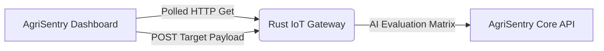

# AgriSentry Dashboard (Agricultural Operations Center)


High-fidelity single-page operational interface for the AgriSentry IoT ecosystem. This dashboard acts as the **Agricultural Operations Center (AOC)**, rendering real-time streaming telemetry datasets, clustering telemetry physical node indexes, and providing reactive diagnostic frameworks via custom instrumentation pipelines.

## System Architecture Overview

The dashboard interfaces asynchronously with the ecosystem infrastructure to compile physical event data into actionable telemetry metrics:



* **Data Aggregation:** Continually polls stateful ingestion data streams every 2500ms to update metrics reactively without page mutations.
* **Store-and-Forward Simulator:** Features an integrated physical payload transmission matrix to load backdated retrogressive sequences straight down the validation layers.
* **Unified Infrastructure Log Stream:** Multiplexes asynchronous server event logging arrays alongside local UI lifecycle logs inside a synthetic terminal interface.

## Key Interface Capabilities

* **Field Health Index Matrix:** Dynamically computes a holistic stability percentage rating based on the programmatic ratio between valid readings versus structural outliers or hardware noise.
* **Interactive Telemetry Target Simulator:** Enables direct manual configuration over hardware batch sizes, retrogressive timeline delta intervals, and custom signal threshold values to mock field testing routines.
* **Adaptive Sensor Status Indicators:** Color-coded UI components mirroring complex state responses straight from the API layer (`VALID` 🟢, `ANOMALY_NOISE` 🔵, `ANOMALY_CRITICAL` 🔴).
* **Relative Micro-Synchronization Counter:** Translates ISO structural database timestamps into human-readable relative string updates (*"Synchronized 4m ago"*).

---

## 🌐 Platform Architecture Connections

To review the underlying engine and ingestion layers of this ecosystem, refer to the related system repositories:

* **Ingestion Gateway (Rust):** [agrisentry-iot-gateway](https://github.com/arleujr/agrisentry-iot-gateway)
* **Processing Engine (Python / FastAPI):** [agrisentry-core](https://github.com/arleujr/agrisentry-core)

---

## Quick Start

### 1. Environmental Mapping

The frontend application requires connectivity hooks pointing to the ingestion gateway layer. Map your environment profile keys:

```bash
cp .env.example .env

```

**`.env` reference configuration (Local & Cloud Variables):**

```env
# Target REST Gateway API Endpoint Loop
VITE_API_URL=[https://agrisentry-iot-gateway.onrender.com](https://agrisentry-iot-gateway.onrender.com)

```

### 2. Dependency Setup

Install the required node modules using your chosen package manager:

```bash
npm install
# or
yarn install

```

### 3. Compilation for Development

Fire up the local Vite web server engine with active Hot Module Replacement (HMR):

```bash
npm run dev
# or
yarn dev

```

### 4. Production Build Verification

To compile the application down into minified static asset slices optimized for deployment:

```bash
npm run build

```

---

## Production Deployment Matrix

The reference client interface is continuously deployed and accessible at:
👉 **[AgriSentry Dashboard Production Live Stack](https://agrisentry-dashboard.onrender.com/)**

---

## 📄 License

Distributed under the MIT License.
